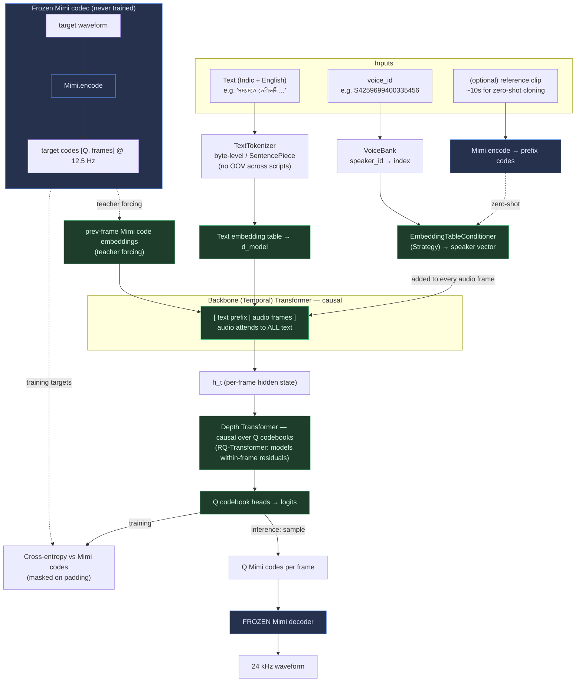

# milli_tts architecture

## End-to-end flow



## Training vs inference

```mermaid
sequenceDiagram
    participant D as IndicVoices (streaming)
    participant C as Mimi (frozen)
    participant M as RQ-Transformer
    participant W as W&B

    rect rgb(31,61,43)
    note over D,W: TRAINING (teacher-forced, parallel)
    D->>C: waveform (target)
    C->>M: codes [Q,T] @ 12.5Hz
    D->>M: text ids + speaker index
    M->>M: backbone (parallel over frames) + depth (parallel over Q)
    M->>W: loss / acc / lr / decoded audio (realtime)
    end

    rect rgb(38,50,77)
    note over C,M: INFERENCE (autoregressive, KV-cached)
    M->>M: prefill text prefix once
    loop each 12.5Hz frame
        M->>M: 1 backbone step + Q tiny depth steps → sample codes
    end
    M->>C: codes
    C->>M: 24 kHz waveform (stream first chunk < 100ms)
    end
```



## Why this works

1. **STT labels are valid TTS pairs.** IndicVoices gives `(transcript, waveform,
   speaker_id)`. TTS is just the inverse direction: condition on text, predict
   the waveform's Mimi codes. The 400 speakers become 400 selectable `voice_id`s
   instead of a problem.

2. **One decoder-only backbone, no text encoder.** Because text is a causal
   *prefix* and audio frames attend back over it, the text conditioning is
   learned end-to-end with zero cross-attention and zero encoder/decoder
   dimension mismatch — everything is internal at `d_model`. Fewer moving parts
   = lower latency.

3. **The depth transformer makes the codebooks tractable.** Mimi uses `Q`
   residual codebooks per 12.5 Hz frame. Predicting all `Q` jointly is hard;
   predicting them autoregressively with a *tiny* depth transformer (the
   RQ-Transformer factorization from Moshi) is both accurate and cheap, and
   removes the need for a MusicGen-style delay pattern.

4. **Freezing Mimi is the cost lever.** We never backprop through the codec, so a
   T4 only has to train a small LM over discrete tokens — orders of magnitude
   cheaper than waveform/diffusion TTS, and the 12.5 Hz frame rate keeps
   sequences short (≈ 125 tokens for 10 s of audio).

5. **`voice_id` is learnable conditioning, not a codec property.** A pretrained
   codec has no speaker identity; we add it ourselves via an embedding table
   (Strategy pattern), exactly like ElevenLabs/Sarvam expose a voice catalog —
   plus a reference-prefix path to clone unseen voices.

6. **Latency budget closes on a T4.** fp16 + KV cache means the text prefix is
   prefilled once, then each frame is one backbone step + `Q` small depth steps.
   With chunked streaming, *time-to-first-audio* (the perceived latency) is the
   number kept under ~100 ms while the tail generates faster than real time.
```
